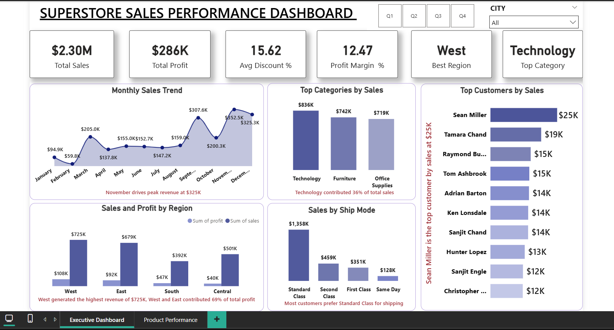
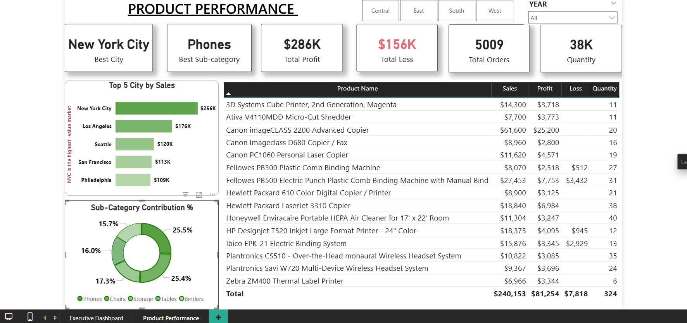

# Superstore-Sales-Dashboard

Interactive Power BI dashboard analyzing Superstore sales, profit, customer behavior, and product performance using DAX, SQL, and data visualization techniques.
Superstore Sales Analysis Dashboard

## Dashboard Screenshots

# Superstore Sales Dashboard | Power BI

## 1. Project Title / Headline

**Retail Sales Performance & Profitability Analysis Dashboard using Power BI**

---

## 2. Short Description / Purpose

This project presents an end-to-end Business Intelligence solution developed using the Superstore Sales dataset. The dashboard is designed to monitor key business metrics, analyze sales and profitability trends, evaluate product performance, and uncover customer purchasing patterns.

By transforming raw transactional data into interactive visualizations and actionable insights, the solution enables stakeholders to track performance, identify growth opportunities, and support data-driven decision-making.

---

## 3. Tech Stack

**Business Intelligence & Visualization**

* Power BI
* DAX (Data Analysis Expressions)

**Data Analysis & Processing**

* SQL
* Python (Pandas, NumPy)

**Data Source & Storage**

* CSV / Excel Files

**Core Skills Applied**

* Data Cleaning & Transformation
* Exploratory Data Analysis (EDA)
* KPI Development
* Dashboard Design
* Business Analytics
* Data Visualization

---

## 4. Data Source

The analysis was performed using the Superstore retail dataset containing transactional sales records across multiple regions, customer segments, and product categories.

### Dataset Attributes

* Order ID
* Order Date
* Customer Information
* Product Details
* Category & Sub-Category
* Sales
* Profit
* Quantity
* Discount
* Shipping Information
* Region & State

---

## 5. Highlights

### Executive Performance Monitoring

* Developed KPI cards for Total Sales, Total Profit, Total Orders, Average Order Value (AOV), Profit Margin, and Average Discount.
* Created an executive dashboard for quick business performance assessment.

### Sales & Profit Analysis

* Analyzed monthly sales and profit trends to identify seasonality and growth patterns.
* Compared revenue generation and profitability across business segments.

### Product Performance Analysis

* Identified top-performing products based on revenue contribution.
* Highlighted loss-making products requiring strategic attention.
* Evaluated category and sub-category performance.

### Customer Insights

* Identified high-value customers contributing significantly to overall revenue.
* Analyzed purchasing behavior across customer segments.

### Regional Analysis

* Compared sales performance across regions and states.
* Identified high-performing and underperforming markets.

### Interactive Reporting

* Implemented slicers, filters, and drill-down capabilities for enhanced user interaction.
* Designed a clean and professional dashboard layout for effective storytelling.

---

## 6. Business Impact / Insights

* Discovered key products driving revenue and profitability.
* Identified loss-making products and categories impacting overall margins.
* Evaluated the relationship between discounting strategies and profitability.
* Revealed seasonal sales trends to support demand forecasting and inventory planning.
* Identified top customers contributing a significant share of total sales.
* Enabled stakeholders to monitor business performance through a centralized dashboard.
* Converted complex transactional data into actionable insights that support strategic business decisions.

---

## Key Performance Indicators (KPIs)

* Total Sales
* Total Profit
* Total Orders
* Average Order Value (AOV)
* Profit Margin %
* Average Discount %
* Top Customer
* Most Profitable Product
* Loss-Making Products

---

## Project Outcome

This project demonstrates practical expertise in Power BI, SQL, Python, DAX, data visualization, and business analytics. It showcases the ability to transform raw business data into meaningful insights through interactive dashboards and KPI-driven reporting, reflecting the responsibilities typically expected from a Data Analyst in a business environment.
